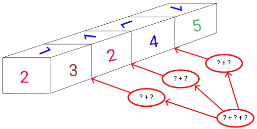

# Exercicio 

Observando a figura a baixo temos 4 dados identicos.
Calcule a soma das faces de contato entre cada dado na imagem.

 * A) 21
 * B) 22
 * C) 17
 * D) 18
 * E) 20

 # Solucao

Como todos os dados são iquais podemos usar a face de "1" 
que esta no topo dos dados.

Premisas:

    O esquema do dado segundo a imagem é:
         [5]
      [4][1][3]
         [2]
Sendo assim fica assim o caculo:

    1° Dado 
        ==> 5 + 4 = 9
    2° Dado
        ==> 3 + 5 = 8
    3° Dado 
        ==> 2 + 3 = 5
    4° Dado 
    =====> 5 + 8 + 9 = 22

## Alternativa:
* B) 22