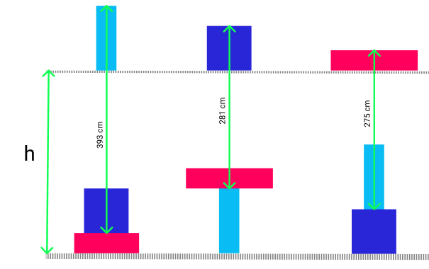
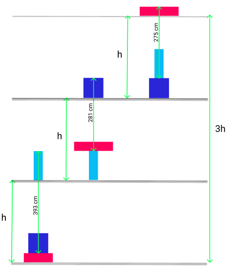
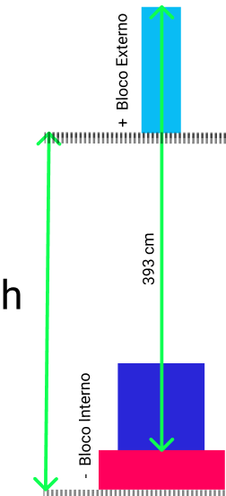

# Exercicio

  Segundo as figuras a baixo calcule o valor de h,
considerando que as figuras de mesma cor são
idênticas. 



 * A) 310 cm
 * B) 652 cm
 * C) 316 cm
 * D) 385 cm
 * E) 306 cm


# Solução

  Vamos tentar tirar a diferença, imaginemos cada 
situação como sendo um valor que esta dentro de h,
sendo assim podemos imaginar algo assim

  * 1° 393 cm = h - (Alguma coisa?) 
  * 2° 281 cm = h - (Alguma coisa?)
  * 3° 275 cm = h - (Alguma coisa?)

  Se considerarmos a figura 2 acima aonde 
podemos ver que 3h possue relação com as 3 situações 
empilhadas, deduzimos que:

  * 1° 393 cm = h (- Bloco Roza) (+ Bloco Azul bebé)
  * 2° 281 cm = h (- Bloco Azul bebé) (+ Bloco Azul marinho)
  * 3° 275 cm = h (- Bloco Azul marinho) (+ Bloco Roza)

Perceba que montamos essa relação usando essa estrutura:

  * ? cm = h (- Bloco Interno) (+ Bloco Externo )




  Como o em cada situação temos (- Bloco Interno) (+ Bloco Externo ),
podemos deduzir que ao somá-los, eles se cancelam, ficamos assim:

  * 1° 393 cm = h <strike>(- Bloco Roza) (+ Bloco Azul bebé)</strike>
  * 2° 281 cm = h <strike>(- Bloco Azul bebé) (+ Bloco Azul marinho)</strike>
  * 3° 275 cm = h <strike>(- Bloco Azul marinho) (+ Bloco Roza)</strike>
 
  Juntando as situações temos:
```
     393 cm     =  h 
     281 cm     =  h 
  +  275 cm     =  h 
  --------------------- 
     949 cm     = 3h
     949 cm / 3 =  h <==== Jogando o 3 para o outro lado da equação
     316 cm     =  h
```

## Alternativa:
* C) 316 cm